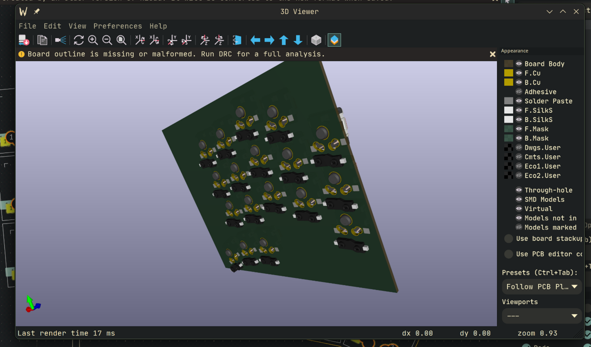

## 10/08/2025
**Time Spent: 6h 20m: **

Firstly, I did some research and decided on some constraints/goals:
1. Must be wireless.
2. Must use KS33 switches (Nuphy ones most likely), as they are cheaper than Choc switches.
3. Must be low-profile. I won't be able to make it very low-profile, not as much as I could have if I used Chocs, but I still want it to look and feel sleek. 
4. Must have at least 3 thumb keys, but not more than 5 columns. I have built a handwired 3x6 build, and while I did enjoy it, I want to try out 3 columns.
5. Hotswappable and reversible PCB. After how much time I wasted on mirroing components for my last trial design, I want something simpler now. The disadvantage would be of course that I would get less PCBs for the price, but oh well it is what it is.

Then, I started messing around with [Ergogen](https://ergogen.ceoloide.com/). I had built the layout for my previous handwired build using this tool, but I had forgetten a lot of things, so I took another look at [FlatFootFox's amazing guide](https://flatfootfox.com/ergogen-introduction/), as well as the config.yaml of the [Avocado](https://github.com/auryn31/avocado) by Auryn. It took a couple of hours, but after messing around with it for some time I got a config I thought looked and felt pretty nice. So I printed out several plates and tested them  with some MX switches and keycaps I had lying around. One thing I really did struggle with was the outline: I tried to somehow combine two outlines (the switch cutouts as well as some cutouts that were 1mm bigger for the switch clips)into one .dxf, but I did not have any success. Eventually I just imported both into Onshape and positioned them there, which was tedious, but such is life. I probably won't make the final version in Ergogen: I find it easier in Onshape. The only thing I really want to use Ergogen for is positioning the switches. 

## 14/08/2025
**Time Spent: 2h 40m**

Struggled quite a bit with figuring out how to make 3D models of the custom KS33 footprint I used from [this](https://github.com/ceoloide/ergogen-footprints) render properly in KiCAD. Turns out it was all because I used "~/path to file" instead of "/home/username/path to file", so yeah I'm dumb. Had to use a custom 3D model for the KS33 from Grabcad, as Ai03's library only has the hotswap 3d model. And I obviously had to adjust the offset and rotation of both models to make them render properly. I especially struggled with the hotswap 3D model: I'd keep going and changing one individual model in the footprint editor, align it properly, add the offset and rotation values to ergogen, download the PCB and low and behold it wouldn't work. After 2h of messing with this damn problem I gave up. I'll just have to design the case another way or edit the values for every model for every switch model manually, which will be tedious but not impossible. Right now the focus is the PCB, as I can modify the case later as I own a 3D printer.
After all that crap, I installed [marbastlib](https://github.com/ebastler/marbastlib), which is an amazing library containing a plethora of keyboard related symbols, 3D models, and footprints and then called it a day.

 

## 15/08/2025
**Time Spent: 3h 40m**

While manually assigning schematic references such "SW1" to the switches, I came across what is in my opinion an extremely cool feature: if you double click on a footprint, under the "Update from library button" there is a button called "Change footprint", and clicking that opens up a menu which allows you to change either that specific fooptrint or all footprints of that type from the board with another footprint. This would have been insanely helpful when I designed Quaero, my first PCB keyboard. I made a copy of the standard 1N4148 diode footprint and edited it so that there is a small cutout, slightly larger than the diode itself, right under the diode. After doing so, I used the aforesaid feature to update all of my diodes. I think I saw/heard somewhere about people pressing their THT diodes into the LED cutouts that come with boards to make the whole board more low-profile, and I'm thinking it won't hurt to tryout this idea for myself. Because I'm using hotswap sockets this will not really reduce the height of my board, but well it's a good idea to include the cutouts anyway. 

I also did part of the routing:

## 19/08/2025
**Time Spent: 3h**
Did a lot of cleaning up and double-checking: decided what button to use for the reset and power switches, got the footprints, made them reversibe (kinda), and most importantly troubleshooted the damn MCU. The problem was that the symbol for the MCU (which I got from marbastlib), had the pin assignments descending from 1 to 12 on the left, and then again from the top descending from 13 to 24, while all the reversible footprint I found had the pins descending from the top on the left and then ascending from the bottom on the right. Turns out that it's common practice to do the latter, and not the former. At first I tried to edit the pin assignments of the footprint, only to realise after some time that I can just swap the symbol (yes I'm dumb). Wasted a lot of time on this issue. 

